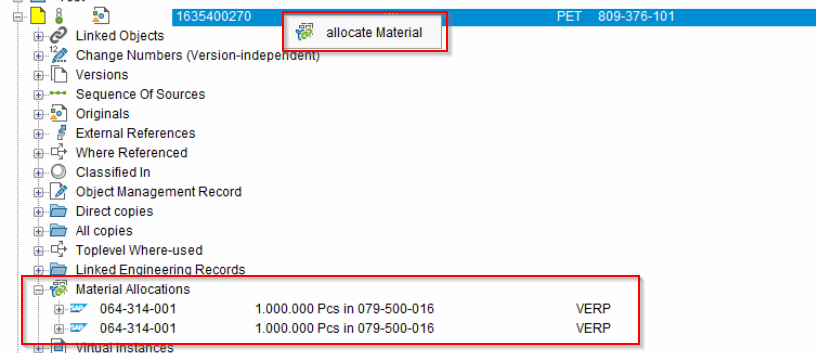
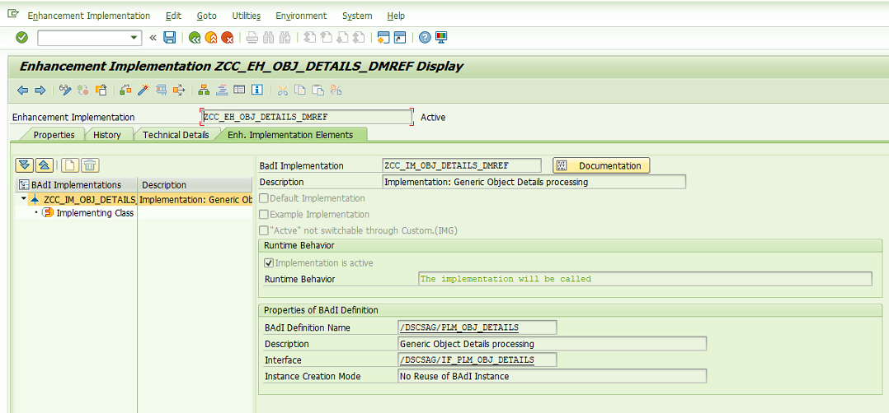

# ReadMe

In diesem Beispiel wird dargestellt wie man einen eigenen Generic Container im ECTR anzeigt und diesen zu mit Objekten befüllt bzw. diese wieder löscht.

Die Kommunikation erfolgt hierbei per Macros.

Um es zu testen den Ordner _AddON_Ex_ in das Verzeichnis *%ECTR_INSTALLATION%\addons* kopieren.

## ABAP

### BAdI

Für das generische Objekt muss eine Implementierung des BAdI /DSCSAG/PLM_OBJ_DETAILS angelegt werden.

Implementierende Classe `ZCC_CL_OBJ_DETAILS_DMREF`.

#### Container Obj

Anhand des Bausteins `Z_ZCC_FM_DMREF_GET_ASSIGNMNT` werden die Infos des Containers an den ECTR übergeben.
Baustein wird durch das MAcro aufgerufen.

#### Container Struktur 

In der Klasse `ZCC_CL_OBJ_DETAILS_DMREF` wird durch die Methode `METHOD /dscsag/if_plm_obj_details~get_obj_details_gen.` die Struktur des Containers mit Daten befüllt.

