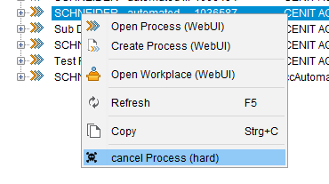

# cancle Process

- [cancle Process](#cancle-process)
  - [Description](#description)
  - [Prerequisite](#prerequisite)
  - [Configuration](#configuration)
    - [Macro](#macro)
    - [Menu Macro](#menu-macro)
    - [Menue Guid](#menue-guid)
    - [dictionary](#dictionary)
    - [Icon](#icon)
  
## Description

This Macro will cancel an APM Process. The default APM Kontext Menue was Enhanced so that there ia a new Entry.



## Prerequisite

You need the APM installed (ABAP-Backend) and also da ECTR-APM-AddOn.
Also the ABAP Function Module `ZRFC_ECTR_SET_PROC_STATUS` has to be implemented.

## Configuration

### Macro

Put the macro `cancelProcess.macro` into the Folder %ECTR_INSTALLATION%\customize\scripts\macros.

### Menu Macro

In file *%ECTR_INSTALLATION%\addons\apm\customize\config\menu_macros.txt* add the following statements after the Menue `? MENU_APM_TSK` .

```sh
# Process Enhancements
# ---
# Enhancements of APM Standard Menue
# The Macro should avaivaible in %ECTRInstallation%\customize\scripts\macros
# or have a (relative) Path
#------------------------------------------------
? ENHANCED_MENUE_APM_PRO = fnc.execute.macro(cancelProcess.macro)
```

### Menue Guid

In file *%ECTR_INSTALLATION%addons\apm\customize\config\menu.guidef* add the following statement `= ? ENHANCED_MENUE_APM_PRO` after the Menue `? MENU_APM_PRO`.

The result should look like this:

```sh
# Functions for Process
#------------------------------------------------
+  om.popup.menu.APM_PRO                = ? MENU_APM_PRO
                                        = -----------------------------
                                        = ? CLPBRD_OBJ
                                        = -----------------------------
                                        = ? ENHANCED_MENUE_APM_PRO # <-- this
```

### dictionary

In file *%ECTR_INSTALLATION%addons\apm\basis\dictionary\en\ectr.txt* add the following statements after `fnc.api.generic2(ECTR_PRO_CREATE_DIRS) = Prozess erstellen`

```sh
# Process Enhancements
#------------------------------------------------
fnc.execute.macro(killProcess.macro) = Prozess abbrechen (hard)
```

Repeat this for each language you want to maintain (de, etc.).

### Icon

To enable an icon in the Menue put the follow text in file *%ECTR_INSTALLATION%\addons\apm\basis\aux-files\standard_icons.txt* below the *Process* Section.

```sh
# Process Enhancement
fnc.execute.macro(killProcess.macro) = apm/{0}/skull
```

Also you have to provide a icon named *skull.png* in jar File in *%ECTR_INSTALLATION%\addons\apm\basis\classes\images.jar*

Sizes

- 12 x 12
- 24 x 24
- 32 x 32
