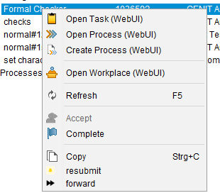
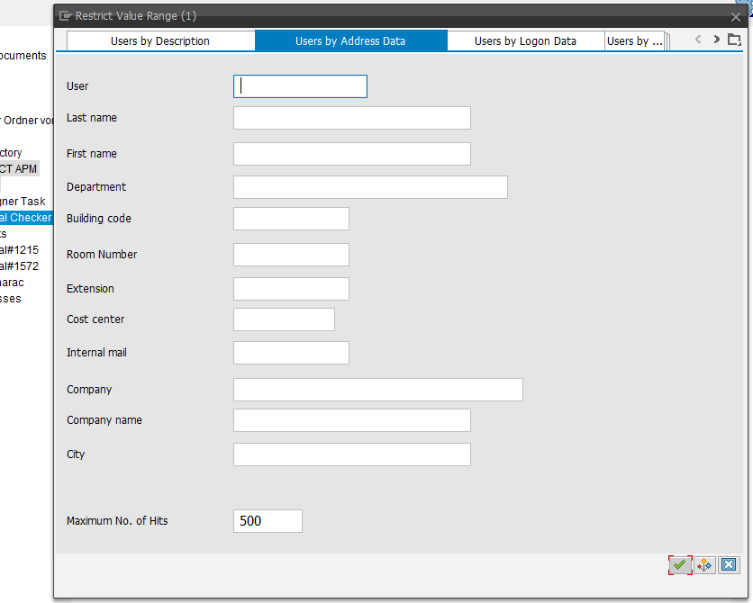

# Forward a Task

- [Forward a Task](#forward-a-task)
  - [Description](#description)
    - [Result](#result)
  - [Prerequisite](#prerequisite)
  - [Configuration](#configuration)
    - [Macro](#macro)
    - [Menu Macro](#menu-macro)
    - [Menue Guid](#menue-guid)
    - [dictionary](#dictionary)
    - [Icon](#icon)
  
## Description

This macro forward a AMP-Task to a specified user. The descriped configuration enhance the APM default configuration.

### Result

The standard menue was enhanced with *forward*.



A search help is opened to select the appropriate user. The task is then forwarded to this user.


## Prerequisite

You need the APM installed (ABAP-Backend) and also da ECTR-APM-AddOn.
Also the ABAP RFC-Function Module `ZRFC_ECTR_FORWARD_TASK` has to be implemented.

## Configuration

### Macro

Put the macro `forward.macro` into the Folder %ECTR_INSTALLATION%\customize\scripts\macros.

### Menu Macro

In file *%ECTR_INSTALLATION%\addons\apm\customize\config\menu_macros.txt* add the following statements after the Menue `? MENU_APM_TSK` .

```sh
# Task Enhancements
# ---
# Enhancements of APM Standard Menue
#------------------------------------------------
? ENHANCED_MENUE_APM_TSK = fnc.execute.macro(forwardTask.macro)
```

### Menue Guid

In file *%ECTR_INSTALLATION%addons\apm\customize\config\menu.guidef* add the following statement `= ? ENHANCED_MENUE_APM_TSK` after the Menue `? MENU_APM_TSK`.

The result should look like this:

```sh
# Functions for Task
#------------------------------------------------
+  om.popup.menu.APM_TSK                = ? MENU_APM_TSK
                                        = -----------------------------
                                        = fnc.apm.task.change.status(Accepted)
                                        = fnc.apm.task.complete
                                        = -----------------------------
                                        = ? CLPBRD_OBJ
                                        = ? ENHANCED_MENUE_APM_TSK # <-- this
```

### dictionary

In file *%ECTR_INSTALLATION%addons\apm\basis\dictionary\en\ectr.txt* add the following statements after `cenit.apm.task.comment.field.is.not.maintained = Comment field is not maintained.`

```sh

# Task Enhancements
#------------------------------------------------
 fnc.execute.macro(forwardTask.macro) = forward
```

Repeat this for each language you want to maintain (de etc.).

### Icon

To enable an icon in the Menue put the follow text in file *%ECTR_INSTALLATION%\addons\apm\basis\aux-files\standard_icons.txt* below the *Task* Section.

```sh
# Task Enhancement
fnc.execute.macro(resubmitTask.macro) = apm/{0}/forward
```

Also you have to provide a icon named *forward.png* in jar File in *%ECTR_INSTALLATION%\addons\apm\basis\classes\images.jar*

Sizes

- 12 x 12
- 24 x 24
- 32 x 32
