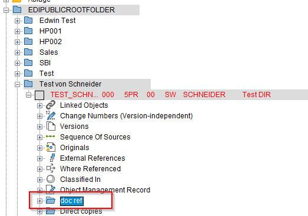

# SmarttContainer Folder attached to DIS

In diesem Beispiel soll ein Ordner (SmartContainer) einem DIS hinzugefügt werden.

Das Beispiel soll wie folg aussehen:



## HowTo

In der %ECTR_INSTALLATION%/customize/config/default.txt folgende Anpassungen hinzufügen (Zeile 2543):

```sh
# -----------------------------------------------------------------------------
# 3.5.2 Object display / Containers

...
# Examples:
#     plm.om.DOC.containers                 = <list of containers>
#     plm.om.DOC.containers.<DOCTYPE>       = <list of containers>
#     plm.om.DOC.containers.fgroup.<FGROUP> = <list of containers>


# --> Add: SMART_CONT(DOC_REF_sc)
      plm.om.DOC.containers     = SMART_CONT(DOC_REF_sc);SMART_CONT(Copied_Doc_SL);@plm.om.DOC.containers@
      plm.om.DOC.containers.FOL = VERSIONS;ORIGINALS;WHEREUSED;CLASSES

# SmartContainer Definitions

#--- DOC Ref Container (DOC_REF_sc)
      plm.smart.container.DOC_REF_sc.name = doc ref
      plm.smart.container.DOC_REF_sc.macro = generic_SmartContainer_macro.txt
      plm.smart.container.DOC_REF_sc.params.0 = FM:/DSCSAG/DOC_TARGETS_GET
      plm.smart.container.DOC_REF_sc.params.1 = ALL_LEVELS
      plm.smart.container.DOC_REF_sc.params.2 = TRUE
      plm.smart.container.DOC_REF_sc.icon = {0}/sap/folder_open
#-- END
```
