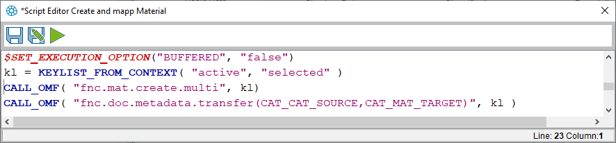

# Multiple Calls

## Beschreibung

Über ein Macro im ECTR lassen sich verschiedene Funktionen nacheinander aufrufen. Dieses lässt sich nutzen um zum Beispiel das Mapping nach Anlage eines Materials aufzurufen.

## Schritt-für-Schritt-Anleitung

Ab ECTR 5.2.4 gibt es die Möglichkeit im ECTR über Sync DIS zu MAT durch den Anwender ein Mapping zwischen DIS und Material aufzurufen.

Im ECTR lassen sich verschiedene Funktionen *nacheinander/sequentiell* aufzurufen.

Hierfür ist es notwendig den Execution_Mode im Macro umzuschalten. Dafür gibt es die Variable `$SET_EXECUTION_OPTION`.




## Zusätzliche Informationen

```js
$SET_EXECUTION_OPTION("BUFFERED", "false") //sequential mode for Macros

kl = KEYLIST_FROM_CONTEXT( "active", "selected" )

CALL_OMF( "fnc.mat.create.multi", kl ) //create material

CALL_OMF( "fnc.doc.metadata.transfer(CAT_MAT_SOURCE,CAT_MAT_TARGET)", kl )//sync dis 2 mat
```

